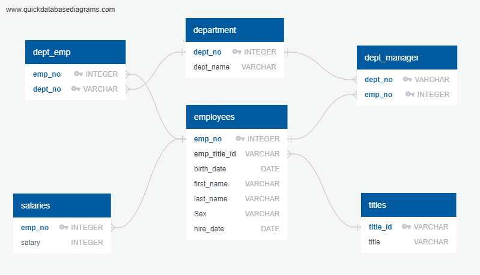

# SQL-challenge

## Data Modeling

### Inspect the CSVs () and sketch out an ERD of the tables.

## Data Engineering

Using the information from the ERD, I have created a database table schema for each of the six CSV files in the [Employees Table Schema](./EmployeeSQL/Employee_Tables_Schema.sql) file, specifying the data types, primary keys, foreign keys, and other constraints.

## Data Analysis

In the [Employees DB Queries](./EmployeeSQL/Employees_db_queries.sql) file, you will find SQL queries that display the requested information below:

1. List the employee number, last name, first name, sex, and salary of each employee.
2. List first name, last name, and hire date for employees who were hired in 1986.
3. List department number, department name, the manager's employee number, last name, first name for the manager of each department
4. List the department of each employee with the following information: employee number, last name, first name, and department name.
5. List first name, last name, and sex for employees whose first name is "Hercules" and last names begin with "B."
6. List all employees in the Sales department, including their employee number, last name, first name, and department name.
7. List all employees in the Sales and Development departments, including their employee number, last name, first name, and department name.
8. In descending order, list the frequency count of employee last names, i.e., how many employees share each last name.

## Data Visualization with Pandas

In the [Employee DB visualization in Python](./EmployeeSQL/Employee_db_analysis.ipynb) file, I have imported the Employees SQL database into Pandas for further analysis and visualization.The file contains the code for importing the SQL database into Pandas as well as the below graphs:

* A histogram to visualize the most common salary ranges for employees.
* A bar chart of average salary by title.
